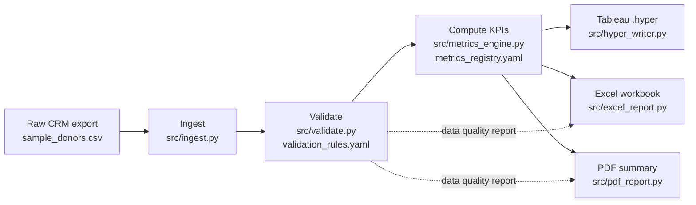

# Advancement Analytics Pipeline


**Messy CRM export in, governed executive report out — automatically.**

A real advancement/fundraising shop's donor data almost never arrives clean: mixed
date formats, inconsistent name casing, the occasional negative gift amount or
duplicate donor record from a bad CRM merge. This pipeline takes that kind of raw,
Salesforce-Ascend-style export and turns it into a trustworthy, governed deliverable
with zero manual spreadsheet wrangling: it ingests the file, runs it against a versioned
set of business rules, computes a standard set of fundraising KPIs (LYBUNT, SYBUNT,
retention, participation, etc.) against versioned metric *definitions*, and writes out
a Tableau extract plus an executive Excel workbook and a one-page PDF summary — every
time, the same way, with a visible data-quality scorecard attached so the numbers are
never presented without their caveats.

All data in this repository is **synthetically generated**. **Carmari Academy** is a
fictional institution created for this portfolio project — no real donor, alumni, or
institutional data is used anywhere in this repo.

## Architecture



Orchestrated end-to-end by `src/pipeline.py`, a single CLI command that runs every
stage and logs timing and status as it goes.

## Quickstart

Requires Python 3.11+.

```bash
# 1. Clone and set up a virtual environment
git clone https://github.com/acramos1914-gif/advancement-analytics-pipeline.git
cd advancement-analytics-pipeline
python -m venv .venv
source .venv/bin/activate        # Windows: .venv\Scripts\activate
pip install -r requirements.txt

# 2. (Optional) Regenerate the synthetic dataset
python data/generate_synthetic_data.py --records 5000 --donors 1800 --output data/sample_donors.csv

# 3. Run the full pipeline
python -m src.pipeline run --input data/sample_donors.csv --output-dir output/

# 4. Run the test suite
pytest -v
```

Outputs land in `output/`: `carmari_academy_extract.hyper`, `executive_report.xlsx`,
and `executive_summary.pdf`.

## Before / after

**Before** — a raw export row, straight out of the CRM (mixed date format, stray
whitespace, inconsistent casing, missing fields):

```
gift_id,donor_id,first_name,last_name,email,...,gift_date,gift_amount,fund_designation
G200017,CA101290,Shannon,MORROW,shannon.morrow216@hotmail.com,...,2025-06-15,3292.94,Unrestricted
G200026,CA101291,  Kyle ,Bell,,...,2025-03-04,69.35,Endowment
G200008,CA100446,Paula,Warner,paula.warner587@yahoo.com,...,"December 01, 2025",322.55,Annual Fund
G200014,CA101273,Christopher,Barber,christopher.barber325@gmail.com,...,05/04/2023,47.63,Annual Fund
```

**After** — `executive_report.xlsx`: a **KPI Summary** sheet listing every governed
metric (value, version, plain-English formula) and a **Data Quality Summary** sheet
with a red/yellow/green scorecard per validation rule (severity, records affected,
% affected, sample IDs). `executive_summary.pdf` condenses both into a single page:
KPI highlights on top, the data-quality scorecard below, so a reader never sees a
number without seeing its trustworthiness in the same glance.

## KPI definitions

Full versioned definitions live in [`config/metrics_registry.yaml`](config/metrics_registry.yaml).
In plain English:

| KPI | What it tells you |
|---|---|
| **LYBUNT** | Donors who gave last fiscal year but haven't given yet this fiscal year — your highest-priority re-engagement list. |
| **SYBUNT** | Donors who gave in any of the last three fiscal years but not this one — a broader lapsed-donor pool for intermittent givers. |
| **Donor Retention Rate** | Of the donors who gave last fiscal year, what percentage gave again this year. Industry benchmark is typically 40–60%. |
| **Alumni Participation Rate** | What percentage of all alumni of record have made a gift this fiscal year — a metric often reported externally (boards, rankings). |
| **Average Gift** | Total dollars given this fiscal year divided by the number of gifts (not donors) this fiscal year. |
| **Year-over-Year Giving Change** | How this fiscal year's total giving compares to last fiscal year's, as a percentage change. |
| **New Donor Acquisition** | Count of donors making their first-ever recorded gift this fiscal year. |

Fiscal year convention: July 1 – June 30, labeled by the calendar year in which it ends
(e.g. a gift on 2025-08-15 falls in FY2026).

## Data quality rules

Full rule definitions live in [`config/validation_rules.yaml`](config/validation_rules.yaml),
covering required fields, email format, non-negative/reasonable gift amounts, valid
class-year ranges, future-dated gifts, and donor-record merge conflicts (inconsistent
name spelling under one donor ID). Every rule is evaluated independently each run, with
severity (`critical`/`warning`), records affected, and sample IDs reported — nothing is
silently dropped.

## Repository structure

```
advancement-analytics-pipeline/
  data/                        synthetic data generator + committed sample export
  config/                      versioned KPI + validation rule definitions (YAML)
  src/                         ingest -> validate -> compute -> hyper/excel/pdf
  tests/                       unit + end-to-end tests against a hand-checked fixture
  .github/workflows/ci.yml     installs deps, runs pytest, runs the pipeline, uploads output/
```

## Design notes

Decisions made while building this that weren't fully specified up front:

- **Fiscal year convention**: July 1 – June 30, labeled by the ending calendar year.
  Chosen because it's the most common convention in U.S. higher-ed advancement shops.
- **Gift-level export shape**: the dataset is one row per gift (donor attributes
  repeated per row), matching how Salesforce/Ascend report exports typically flatten
  a donor-to-gift relationship, rather than two separate donor/gift tables.
- **Duplicate donor detection**: since donor_id legitimately repeats once per gift in
  a gift-level export, the `duplicate_donor_id` rule instead flags donor IDs whose
  associated name spelling/casing is inconsistent across rows — a realistic signal of
  a CRM records-merge problem — rather than flagging ordinary repeat gift rows.
  All rows sharing that donor ID are flagged, since it's unclear which spelling is
  correct without manual review.
- **Metrics computed on "clean-enough" rows**: rows missing donor_id, gift_date, or
  gift_amount (already surfaced as critical data-quality failures) are excluded from
  KPI math rather than propagating NaN/NaT into every aggregate; everything else
  (e.g. a too-large gift amount, a malformed email) still counts toward KPIs, since
  KPI inclusion and data-quality flagging are deliberately separate concerns.
  The data-quality scorecard is exactly how a reader knows which numbers to trust.
- **CLI framework**: `click` over `argparse`, for cleaner option parsing and
  automatic `--help` generation.
- **Python version**: developed and CI'd on Python 3.13 rather than a newer release,
  since `tableauhyperapi` wheel availability lags behind the latest CPython release.

## Tech stack

Python 3.11+ · pandas · PyYAML · Faker · tableauhyperapi · openpyxl · reportlab ·
pytest · click · GitHub Actions
